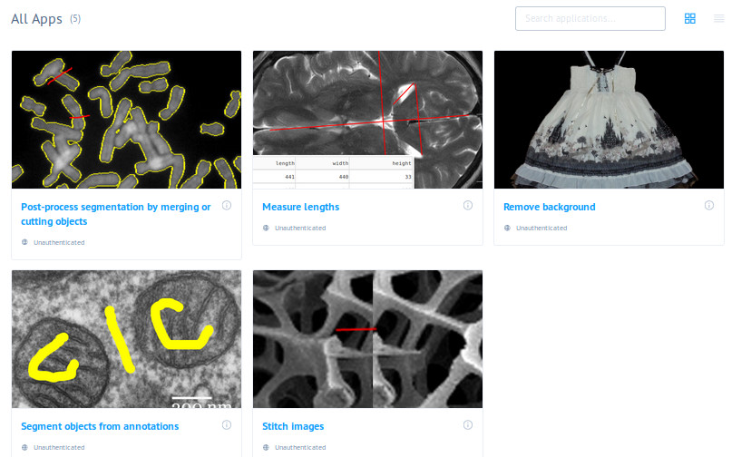

# Gallery of examples using dash-canvas

These apps use the Dash framework and the package dash-canvas for
annotating images and image processing.

The gallery is deployed on https://dash-canvas.plotly.host/Portal.

For local use, each app is a subfolder of ``apps``. Enter one of these
subfolders, install the requirements with

```
pip install -r requirements.txt
```

and launch the app with

```
python app.py
```



